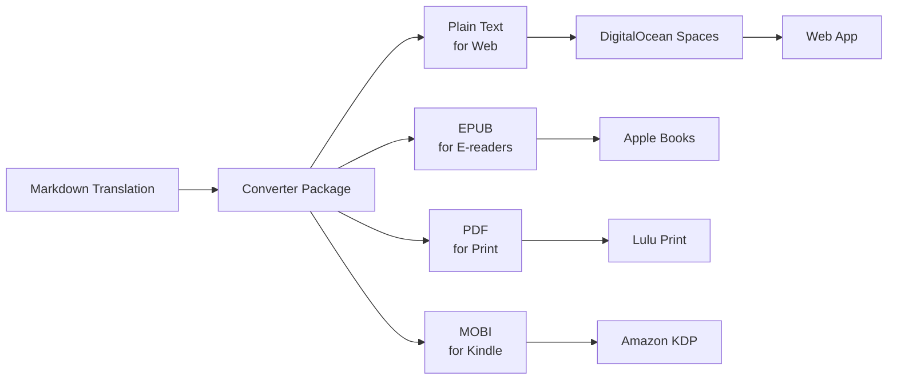

# 📚 Brainrot Publishing House - Monorepo

> _Making classic literature absolutely bussin' for Gen Z, no cap fr fr_

## 🚀 What Is This?

Brainrot Publishing House creates hilarious Gen Z "brainrot" translations of classic literature. We're talking Shakespeare but make it TikTok. Fitzgerald but make it Discord. Homer but make it Twitch chat.

This monorepo contains:

- **Web App**: Next.js reading platform in `apps/web/` (no reachable public site verified)
- **Translations**: The actual book translations (our crown jewels)
- **Publisher**: KDP/Lulu CLI code; the top-level `publish` command is not implemented
- **Converter**: Tools to transform content for different platforms

**Site status (checked 2026-09-25):** Neither `brainrotpublishing.com` nor
`www.brainrotpublishing.com` resolves in a direct `curl` probe. GitHub's latest
Preview deployment (2025-11-10) and Production deployment (2025-09-16) are
marked inactive. The repo has CI but no web deployment workflow; a working
production deployment has not been verified.

## ⚠️ CRITICAL: Translation Methodology ⚠️

**BEFORE TRANSLATING ANY CONTENT, READ THIS:**

Our translations follow **"maximalist gremlin mode"** - a specific, documented methodology that ALL contributors must follow:

📖 **MANDATORY READING: `TRANSLATION_GUIDELINES.md`** (1000+ lines of detailed methodology)

### Key Requirements:

- **all lowercase formatting** (no capitals except emphasis)
- **3-5+ brainrot terms per sentence MINIMUM**
- **400+ term vocabulary** including: skibidi, gyatt, rizz, fr fr ong, no cap, lowkey, etc.
- **Character voice mapping** - each character gets 3-5 signature terms
- **Systematic slur replacement** - NEVER reproduce historical slurs
- **1,600+ core term occurrences per book target**

### Example Translation:

```
Original: "I went down yesterday to the Piraeus with Glaucon..."
Brainrot: "so yesterday i was heading down to the piraeus with my boy glaucon (ariston's son) to check out this new festival for the goddess bendis - basically the thracian version of artemis. had to pay my respects and all that, plus i was lowkey curious about how they'd throw down for this thing since it was literally the first time."
```

⚠️ **DO NOT START TRANSLATING WITHOUT READING THE GUIDELINES** ⚠️

## 🏗️ Monorepo Architecture

```
brainrot/
├── apps/
│   ├── web/                    # Next.js 16 web application
│   └── publisher/              # CLI for KDP, Lulu, IngramSpark
├── content/
│   └── translations/
│       └── books/              # All book translations
│           ├── great-gatsby/   # Book source and metadata
│           ├── the-iliad/
│           └── ...             # Other book directories
├── packages/
│   ├── @brainrot/types/        # Shared TypeScript interfaces
│   ├── @brainrot/converter/    # Markdown → Text/EPUB/PDF
│   ├── @brainrot/metadata/     # YAML parsing, ISBN validation
│   └── @brainrot/templates/    # LaTeX/EPUB/Kindle templates
├── scripts/
│   ├── generate-formats.ts     # Convert books to all formats
│   └── sync-translations.ts    # Publish generated text to Spaces
└── turbo.json                  # Turborepo configuration
```

## 🚦 Quick Start

### Prerequisites

```bash
# Required versions
node >= 22.0.0
pnpm >= 8.15.1

# Clone the monorepo
git clone https://github.com/misty-step/brainrot.git
cd brainrot
```

### Get Started

```bash
# Install all dependencies
pnpm install

# Start everything in dev mode
pnpm dev

# Or just the web app
pnpm dev --filter=@brainrot/web

# Build everything
pnpm build

# Run tests
pnpm test
```

### Monorepo Benefits

- **⚡ Cached builds** - Turborepo caches build tasks
- **📦 Shared packages** - Reusable code across all apps
- **🔄 Unified pipeline** - One command to rule them all
- **🎯 Selective execution** - Work on just what you need
- **🔗 Type safety** - TypeScript types shared everywhere

## 📖 Available Books

### Translation Sources (examples)

- **The Great Gatsby** - _"back when i was a lil sus beta and way more vulnerable to getting absolutely ratio'd by life"_
- **The Iliad** - _"greek drama hits different when paris catches feelings"_
- **The Odyssey** - _"odysseus speed-running his way home while poseidon stays pressed"_
- **The Aeneid** - _"aeneas carries his dad out of troy like a true sigma"_
- **Alice in Wonderland** - _"alice falls down the most unhinged discord server"_
- **Frankenstein** - _"victor creates life then ghosts harder than your crush"_
- **Declaration of Independence** - _"the colonies said 'we're breaking up with u britain'"_
- **Simple Sabotage Field Manual** - _"how to troll your workplace (CIA approved)"_
- **Hamlet** - Five translated acts under `content/translations/books/hamlet/brainrot/`
- **The Republic** - Translation chapters under `content/translations/books/the-republic/brainrot/`

### In Progress

- **La Divina Comedia** - Complex 3-part structure needs special handling
- **Tao Te Ching** - Source text ready, translation pending

### Coming Soon

- Pride and Prejudice
- Romeo and Juliet
- Paradise Lost
- And 100+ more classics

## 🔧 Development

### Tech Stack

- **Monorepo**: Turborepo + pnpm workspaces
- **Web**: Next.js 16 + React 19 + TypeScript
- **Styling**: Tailwind CSS + Radix UI
- **Storage**: DigitalOcean Spaces
- **Publishing**: Playwright (KDP) + Axios (Lulu API)
- **Testing**: Vitest + React Testing Library
- **CI/CD**: GitHub Actions + DigitalOcean App Platform

### Commands

```bash
# Development
pnpm dev                        # Start all apps in dev mode
pnpm dev --filter=@brainrot/web # Web app only
pnpm build                      # Build all workspaces
pnpm lint                       # Run workspace lint scripts (web/publisher skip)

# Testing (Powered by Vitest)
pnpm test                       # Run tests in watch mode
pnpm test:run                   # Run tests once (CI mode)
pnpm test:ui                    # Open Vitest UI for interactive testing
pnpm test:coverage              # Generate coverage report
pnpm test:watch                 # Alias for pnpm test

# Content Pipeline
pnpm generate:formats book [book] # Convert one book to release formats
pnpm generate:formats all         # Process all books
pnpm sync:spaces book [book]      # Publish one generated book to Spaces
pnpm sync:spaces all              # Publish all generated books

```

`apps/publisher` has package-level commands; the root has no `publisher` or
`vault:*` script.

### Environment Variables

For local development, set only the variables relevant to your task. There
are no dotenv-vault scripts in the root package.

- Copy `.env.example` to `.env.local`
- Set `NEXT_PUBLIC_SPACES_BASE_URL` to the authoritative DigitalOcean Spaces bucket
- Add Spaces credentials only for asset publishing or migration operations
- Add `LULU_API_KEY` - For print publishing
- Add `KDP_EMAIL/PASSWORD` - For Amazon publishing

### 🔒 Security Setup

Protect your secrets with our multi-layer security:

```bash
# Install Git hooks for local secret scanning
./scripts/setup-git-hooks.sh

# (Optional) Install gitleaks for enhanced scanning
brew install gitleaks

# Run manual security scan
gitleaks detect --source . -v
```

**Security Features:**

- **Pre-commit hooks** - Prevents accidental secret commits
- **GitHub secret scanning** - Monitors pushed code
- **Custom patterns** - Detects service-specific tokens
- **Gitleaks integration** - Advanced local scanning

See `docs/SECRETS.md` for rotation procedures.

## 🧪 Testing

### Test Stack

We use **Vitest** for unit and integration testing:

- **Native ESM support** - No transforms needed
- **HMR for tests** - Tests re-run instantly on save
- **Compatible API** - Drop-in Jest replacement
- **Built-in coverage** - Via c8/v8

### Running Tests

```bash
# Interactive watch mode (recommended for development)
pnpm test

# Run all tests once
pnpm test:run

# Open Vitest UI - beautiful interface for test exploration
pnpm test:ui

# Generate coverage report
pnpm test:coverage

# Test specific packages
pnpm --filter @brainrot/converter test
pnpm --filter @brainrot/web test

# Run a specific test file or test-name pattern
pnpm exec vitest run download.test.ts
pnpm exec vitest run -t security
```

### Test Coverage

Coverage is available through `pnpm test:coverage`, but
`.github/workflows/ci.yml` currently does not enforce a percentage threshold;
its coverage upload step is commented out.

### Jest → Vitest Migration

We recently migrated from Jest to Vitest. Key changes:

```typescript
// Old (Jest)
import { jest } from "@jest/globals";
const mockFn = jest.fn();
jest.mock("./module");

// New (Vitest)
import { vi } from "vitest";
const mockFn = vi.fn();
vi.mock("./module");
```

**Migration benefits:**

- No more `ts-jest` configuration
- Better TypeScript support out of the box
- Simpler configuration (single `vitest.config.ts`)

For migration details, see our [migration guide](docs/TESTING_MIGRATION.md).

## 📝 Script Organization

### Philosophy: Less is More

The root and web app expose different scripts; consult their respective
`package.json` files before running package-level commands.

### Essential Scripts (from `apps/web/`)

```bash
# Run from apps/web/ (these are not all root package scripts)
pnpm dev         # Start dev server with Turbopack
pnpm build       # Production build with Next.js optimizations
pnpm test        # Run Vitest in watch mode
pnpm lint        # Currently prints a skip notice
pnpm format      # Prettier auto-formatting
pnpm typecheck   # TypeScript type checking
pnpm prettier:fix # Direct Prettier command (alias for format)
```

### Monorepo Scripts

```bash
# Core Development
pnpm dev         # Start all apps in dev mode (Turborepo)
pnpm build       # Build all packages via Turborepo
pnpm lint        # Lint all packages
pnpm typecheck   # Type check everything
pnpm clean       # Nuclear option - clear all caches

# Testing Suite
pnpm test        # Interactive watch mode
pnpm test:run    # Single run (CI mode)
pnpm test:ui     # Beautiful Vitest UI
pnpm test:coverage # Coverage report

# Content & Publishing
pnpm generate:formats book [book] # Convert one book
pnpm sync:spaces book [book]      # Publish one generated book to Spaces
```

### Archived Scripts

Legacy scripts are preserved in `/tools/legacy-scripts/` for historical reference:

```bash
# If you need migration scripts for reference
ls tools/legacy-scripts/

# Each script has documentation
cat tools/legacy-scripts/README.md
```

**Important**: These scripts are archived, not deleted. They serve as:

- Historical record of migrations performed
- Reference for future similar tasks
- Documentation of data transformation logic
- Learning resource for complex operations

### Adding New Scripts

Before adding a new script, ask:

1. **Is it used daily?** → Add to package.json
2. **Is it a one-time task?** → Run with `tsx` directly
3. **Is it rarely used?** → Document in README, don't add script
4. **Is it project-specific?** → Add to that package only

### Direct Execution (No Script Needed)

```bash
# For one-time or rare tasks, just use tsx directly
tsx scripts/some-utility.ts

# Or with Node
node --loader tsx scripts/analyze-something.ts
```

## 📚 Content Pipeline



## 🎯 Publishing Targets

- **Web**: Configured for DigitalOcean App Platform + Spaces; public URL unverified
- **Amazon KDP**: Kindle + Paperback (semi-automated)
- **Lulu**: Print-on-demand (API automated)
- **IngramSpark**: Bookstores (manual)
- **Apple Books**: Coming soon
- **Google Play**: Coming soon

## 🏛️ Project Philosophy

We believe classic literature should be:

1. **Accessible** - No more "thou" and "forsooth"
2. **Entertaining** - Actual laugh-out-loud moments
3. **Relevant** - References that make sense today
4. **Respectful** - The stories remain intact
5. **Educational** - Still learning, just more fun

## 🤝 Contributing

This is currently a private project, but we're considering open-sourcing the translation tools. Stay tuned!

## 📄 License

The translations are original creative works. Classic source texts are public domain.

## 🔗 Links

- **Web App**: `www.brainrotpublishing.com` (currently does not resolve)
- **GitHub**: [github.com/misty-step/brainrot](https://github.com/misty-step/brainrot)
- **Discord**: Coming soon
- **TikTok**: @brainrotpublishing (coming soon)

## ✅ Migration Complete

This monorepo was successfully migrated from two repositories with full git history preserved:

- ✅ `brainrot-publishing-house` → `apps/web/`
- ✅ `brainrot-translations` → `content/translations/`

**Old repositories have been archived with deprecation notices.**

## 🆘 Troubleshooting

### Common Issues

**Great Gatsby not loading?**
First check site availability: the documented public domain currently does not
resolve. Book content in the repository is under `content/translations/books/`.

**App Platform deployment failing?**
Run `pnpm ci:required` locally and check deployment state in DigitalOcean App
Platform. The repository's GitHub Actions CI does not deploy the web app.

### Build failing?

Make sure you have:

- Node.js >= 22.0.0
- pnpm >= 8.15.1
- All environment variables set

### Git history missing?

We use subtree merge to preserve history. If you need to trace back:

```bash
git log --follow apps/web/[file]
git log --follow content/translations/[file]
```

## 📈 Roadmap

### Phase 1: Migration ✅ COMPLETE

- [x] Create monorepo structure with Turborepo
- [x] Migrate repositories with git subtree
- [x] Set up 4 shared packages
- [x] Fix Great Gatsby (blob simplification: 1000 lines → 37 lines)

### Phase 2: Publishing Pipeline ✅ COMPLETE

- [x] Lulu API integration with OAuth2
- [x] KDP automation with Playwright
- [x] Batch processing for all books
- [x] Mock mode for testing

### Phase 3: Production Launch (public site unavailable)

- [ ] Restore and verify a reachable production web deployment
- [ ] Test publishing pipeline with real credentials
- [ ] Launch first 10 books on all platforms
- [ ] Set up analytics and monitoring

### Phase 4: Scale

- [ ] 50 books translated
- [ ] AI-assisted translation tools
- [ ] Subscription service
- [ ] Mobile apps

### Phase 5: Empire

- [ ] 500+ books
- [ ] International versions
- [ ] Educational partnerships
- [ ] Physical bookstore presence

---

_"We're not just translating books, we're translating culture. Shakespeare would've loved TikTok, and we're here to prove it."_

**The Brainrot Publishing House Team**
_Making Literature Absolutely Bussin' Since 2024_
