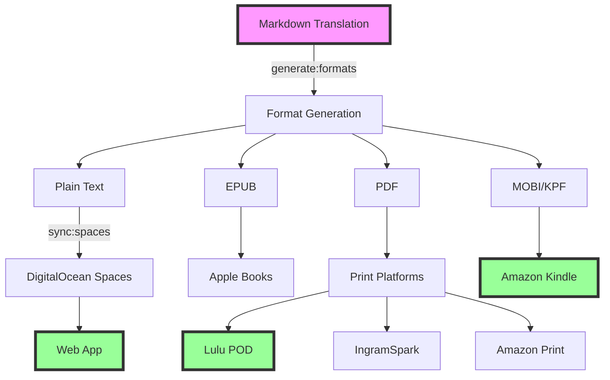

# Publishing Pipeline Documentation (historical Vercel-era guide)

## Overview

This August 2025 guide records the former Vercel Blob and `pnpm publisher`
workflow. Its Vercel deployment and retailer-publishing command examples are
not current operating instructions. The root `package.json` instead defines
`generate:formats` and `sync:spaces`; no working public site was verified on
2026-09-25.



## Pipeline Stages

### 1. Content Creation

**Location**: `content/translations/books/[book-slug]/`

Each book contains:

- `brainrot/` - Chapter markdown files with Gen Z translations
- `metadata.yaml` - Publishing metadata (ISBN, pricing, categories)
- `source.txt` - Original public domain text (reference only)

### 2. Format Generation

**Command**: `pnpm generate:formats book [book-slug]`
**Package**: `@brainrot/converter`

`scripts/generate-formats.ts` currently writes **text** (`.txt`) for web reading.
It accepts `--format epub` and `--format pdf`, but those handlers do not create
files. EPUB and PDF are not currently generated release artifacts.

Output location: `generated/[book-slug]/`

### 3. Web Distribution

**Command**: `pnpm sync:spaces book [book-slug]`
**Automation**: Available through the repository's content workflows

Process:

1. Generated text files upload to DigitalOcean Spaces
2. The web app reads from `NEXT_PUBLIC_SPACES_BASE_URL`
3. Public web delivery remains unverified while the documented site does not resolve

### 4. Print Publishing

#### Amazon KDP (Kindle Direct Publishing)

**Command**: `pnpm publisher kdp publish [book-slug]`
**Automation**: Semi-Automated (Playwright)
**Formats**: Kindle eBook, Paperback

Process:

1. Browser automation with Playwright
2. Handles 2FA authentication
3. Uploads manuscript and cover
4. Sets pricing and territories
5. Can save as draft or publish directly

Credentials required:

- `KDP_EMAIL`
- `KDP_PASSWORD`

#### Lulu Print-on-Demand

**Command**: `pnpm publisher lulu publish [book-slug]`
**Automation**: Fully Automated (API)
**Formats**: Paperback, Hardcover

Process:

1. OAuth2 authentication
2. Creates project via API
3. Uploads interior PDF
4. Uploads cover PDF
5. Sets global pricing
6. Publishes to Lulu marketplace

Credentials required:

- `LULU_API_KEY`
- `LULU_API_SECRET`

#### IngramSpark

**Status**: Manual Process
**Formats**: Paperback, Hardcover

Process:

1. Export print-ready PDF from generated files
2. Manual upload via IngramSpark dashboard
3. Manual metadata entry
4. Manual pricing configuration

### 5. Unified Publishing

**Command**: `pnpm publisher publish-all [book-slug]`

Publishes to all configured platforms:

1. Pre-flight checks (file validation, metadata completeness)
2. Sequential platform publishing
3. Generates consolidated report
4. Saves to `publishing-reports/[date]-[book].json`

## Platform Comparison

| Platform     | Automation | Formats      | Distribution | Royalties | Setup Time |
| ------------ | ---------- | ------------ | ------------ | --------- | ---------- |
| Web (Spaces; site unverified) | Content sync | Text | — | N/A | — |
| Amazon KDP   | Semi       | eBook, Print | Global       | 35-70%    | 24-72h     |
| Lulu         | Full       | Print        | Global       | Variable  | 24-48h     |
| IngramSpark  | Manual     | Print        | Bookstores   | 35-45%    | 1-2 weeks  |
| Apple Books  | Planned    | eBook        | Global       | 70%       | TBD        |
| Google Play  | Planned    | eBook        | Global       | 70%       | TBD        |

## Automation Scripts

### Generate Text Files

```bash
# Single book
pnpm generate:formats book great-gatsby

# All books
pnpm generate:formats all

# With verbose output
pnpm generate:formats book great-gatsby --verbose

# Dry run (no file generation)
pnpm generate:formats book great-gatsby --dry-run
```

### Sync to DigitalOcean Spaces

```bash
# Single book
pnpm sync:spaces book great-gatsby

# All books
pnpm sync:spaces all

# Force re-upload (ignore checksums)
pnpm sync:spaces book great-gatsby --force

# Delete orphaned text files
pnpm sync:spaces book great-gatsby --delete
```

### Publisher CLI

```bash
# List available books
pnpm publisher list

# Validate book before publishing
pnpm publisher validate great-gatsby

# Publish to specific platform
pnpm publisher kdp publish great-gatsby
pnpm publisher lulu publish great-gatsby

# Publish to all platforms
pnpm publisher publish-all great-gatsby

# Dry run mode
pnpm publisher publish-all great-gatsby --dry-run

# Mock mode (no real API calls)
pnpm publisher publish-all great-gatsby --mock
```

## CI/CD Integration

### GitHub Actions Workflows

#### Content Sync (Manual)

**File**: `.github/workflows/sync-content.yml`
**Trigger**: `workflow_dispatch`
**Action**: Generates formats and syncs text to DigitalOcean Spaces

#### Book Publishing (On Change)

**File**: `.github/workflows/publish-books.yml`
**Trigger**: Pushes to `main` or `master` changing `content/translations/books/**`
**Action**: Generates formats and syncs to DigitalOcean Spaces on push; the
retailer-publishing job is gated to manual `workflow_dispatch`

#### Web Deployment

The repository has no `deploy-web.yml`. `.github/workflows/ci.yml` runs quality
checks on PRs and pushes but does not deploy the web app.

## Publishing Checklist

### Pre-Publishing

- [ ] Translation complete and reviewed
- [ ] Metadata.yaml created with ISBNs
- [ ] Cover design ready (if applicable)
- [ ] Categories and keywords selected
- [ ] Pricing strategy determined

### Format Generation

- [ ] Run `pnpm generate:formats book [book]`
- [ ] Verify text files generated
- [ ] Check EPUB validity (if using)
- [ ] Review PDF formatting
- [ ] Test Kindle preview

### Platform Publishing

- [ ] Sync generated text to Spaces for web
- [ ] Publish to KDP (Kindle + Print)
- [ ] Publish to Lulu (POD)
- [ ] Submit to IngramSpark (manual)
- [ ] Update tracking spreadsheet

### Post-Publishing

- [ ] Verify live on all platforms
- [ ] Test purchase flow
- [ ] Update marketing materials
- [ ] Share on social media
- [ ] Monitor initial sales/feedback

## Metadata Requirements

### Required Fields

```yaml
title: "The Great Gatsby but it's Gen Z"
author: "F. Scott Fitzgerald"
translator: "Brainrot Classics"
description: "The classic American novel reimagined..."
language: "en"
publishDate: "2024-01-01"
```

### ISBN Assignment

```yaml
isbn:
  ebook: "979-8-88888-001-1" # Kindle/EPUB
  paperback: "979-8-88888-001-2" # Print on Demand
  hardcover: "979-8-88888-001-3" # Premium Edition
```

### Pricing Structure

```yaml
pricing:
  ebook: 4.99 # Standard ebook price
  paperback: 14.99 # POD paperback
  hardcover: 24.99 # Premium hardcover
```

### Platform Configuration

```yaml
platforms:
  kdp: true # Amazon publishing
  lulu: true # Lulu marketplace
  ingram: false # Manual process
  d2d: false # Future platform
```

## Troubleshooting

### Common Issues

#### Format Generation Fails

- Check pandoc installation: `pandoc --version`
- Verify markdown syntax in source files
- Check metadata.yaml is valid YAML
- Review error logs in console output

#### Blob Storage Sync Errors

- Verify `BLOB_READ_WRITE_TOKEN` is set
- Check network connectivity
- Review `sync-log.json` for details
- Use `--force` flag to override checksums

#### KDP Publishing Blocked

- Check 2FA is properly configured
- Verify KDP account is in good standing
- Review screenshot captures for errors
- Try headed mode: `--headed`

#### Lulu API Errors

- Verify API credentials are valid
- Check OAuth token hasn't expired
- Review API response in verbose mode
- Use mock mode for testing

### Debug Commands

```bash
# Test with verbose output
pnpm publisher publish-all great-gatsby --verbose

# Run in headed mode (see browser)
pnpm publisher kdp publish great-gatsby --headed

# Use mock mode (no real API calls)
pnpm publisher publish-all great-gatsby --mock

# Check configuration
pnpm publisher validate great-gatsby
```

## Security Considerations

### Credential Management

- Never commit credentials to repository
- Use dotenv-vault for secret sharing
- Rotate API keys monthly
- Use 2FA where available

### File Validation

- Validate all uploaded files
- Check file sizes before upload
- Verify checksums for integrity
- Scan for malicious content

### API Rate Limiting

- Respect platform rate limits
- Implement exponential backoff
- Cache API responses
- Monitor usage with `pnpm monitor`

## Future Enhancements

### Planned Features

- Apple Books integration (iBooks Author)
- Google Play Books support
- Audiobook generation with AI voices
- Translation quality scoring
- A/B testing for covers/descriptions
- Sales analytics dashboard
- Automated marketing campaigns

### Platform Expansion

- Barnes & Noble Press
- Kobo Writing Life
- Draft2Digital aggregation
- Smashwords distribution
- BookBaby services

### Automation Improvements

- Parallel platform publishing
- Automatic cover generation
- AI-powered description writing
- Dynamic pricing optimization
- Review monitoring and response

## Support Resources

### Documentation

- [Vercel Blob Storage](https://vercel.com/docs/storage/vercel-blob)
- [Amazon KDP Guidelines](https://kdp.amazon.com)
- [Lulu API Documentation](https://developers.lulu.com)
- [IngramSpark File Creation](https://www.ingramspark.com/plan/tools)

### Tools

- [Pandoc](https://pandoc.org) - Document conversion
- [Calibre](https://calibre-ebook.com) - eBook management
- [Playwright](https://playwright.dev) - Browser automation
- [Commander.js](https://github.com/tj/commander.js) - CLI framework

### Community

- Project Issues: [GitHub Issues](https://github.com/phrazzld/brainrot/issues)
- Discord: #publishing channel
- Email: publishing@brainrot.pub

## Quick Reference Card

```bash
# Generate and sync one book (not a live-site or retailer verification)
pnpm generate:formats book great-gatsby
pnpm sync:spaces book great-gatsby
```

---

_Last Updated: 2026-09-25_
_Version: 1.0.0_
